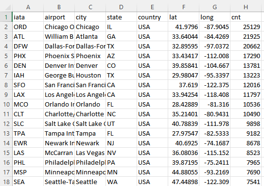
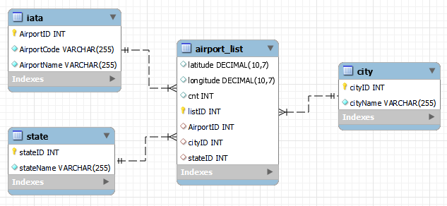

<h1 align="center">
MySQL DB Normalization Practice
</h1>

* Practice importing data to MySQL Workbench and creating normalized database to store data (up to 3NF)
* The dataset used is "airport.csv", containing information of airports in the US
* The .pdf report shows step-by-step process of normalization and presents queries that help answer a few business questions
* "airport_schema.png" shows the final schema design for the 3NF database

<h3 align=center> Glimpse of dataset</h3>

 
<h3 align=center>  3NF Schema Design</h3>

